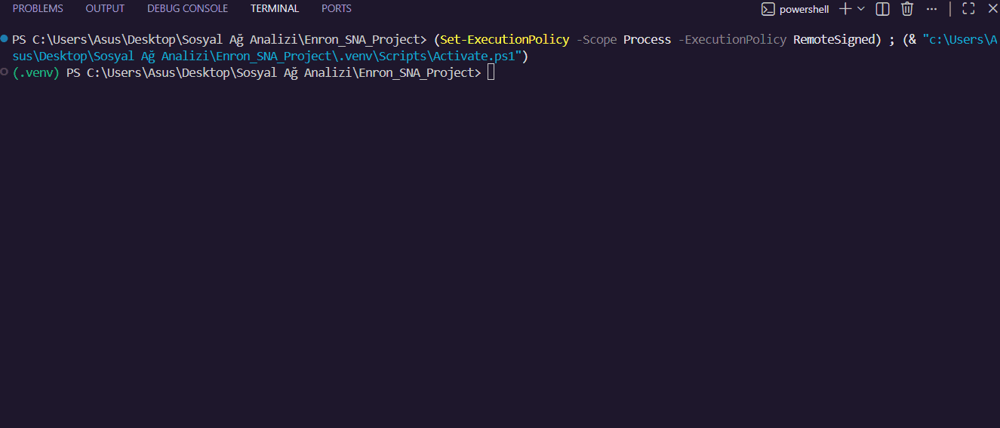

# Enron Sosyal Ağ Analizi Projesi



Bu proje, Sosyal Ağ Analizi dersi kapsamında Enron e-posta veri seti kullanılarak gerçekleştirilmiş ağ analitiği çalışmalarını içermektedir.

## Proje İçeriği
1. **Veri Seti:** Stanford SNAP üzerinden Enron Email Ağı kullanılmıştır.
2. **Kullanılan Kütüphaneler:** Python NetworkX, Community (Louvain).
3. **Temel Ölçümler:** Yoğunluk (Density), Ortalama Derece (Average Degree), Kümelenme Katsayısı (Clustering Coefficient), Bağlantılı Bileşenler.
4. **Topluluk Belirleme:** Louvain algoritması kullanılarak e-posta trafiğine dayalı topluluklar tespit edilmiştir.
5. **Merkezilik:** Derece Merkeziliği (Degree Centrality) ve PageRank hesaplamaları yapılarak organizasyondaki kilit aktörler bulunmuştur.
6. **Ar-Ge (Bağlantı Tahmini):** Adamic-Adar İndeksi kullanılarak, şirketteki en aktif çalışan için olası "yeni bağlantı (iletişim)" önerileri hesaplanmıştır.

## Kurulum ve Çalıştırma
Projeyi çalıştırmak için gerekli kütüphaneleri yükleyin:
```bash
pip install networkx python-louvain
```

Ardından analiz dosyasını çalıştırın:
```bash
python enron_analizi.py
```
Not: Script ilk çalıştığında veri setini (email-Enron.txt.gz) otomatik olarak indirecektir.

## Rapor Hakkında
Çıktılardaki metrikler ve yorumlar raporlanarak PDF formatına dönüştürülmüştür. 
Geliştirme ortamı ve kodlar bu dizinde yer almaktadır.
